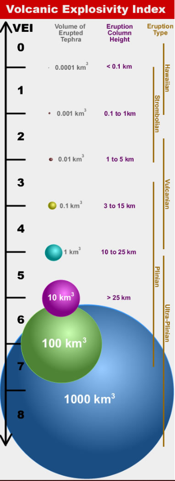

# Final_project
Volcanic Explosivity Index (VEI) prediction - classification model prediction

## To take in account

IMPORTANT:

**PLEASE OPEN THE NOTEBOOK WITH NBVIEWER**: https://nbviewer.org/github/Cristina-Porta-Serrano/Final_project/blob/main/Volcanos/Volcanos.ipynb
 
 **THERE ARE DINAMYC VISUALIZATIONS THAT CANNOT BE DISPLAYED ON THE JUPYTER NOTEBOOK UPLOADED ON GITHUB.**

## State of art

The data collected in these datasets comes from The Smithsonian Institution. Founded on August 10, 1846, it is a group of museums and education and research centers, the largest such complex in the world, created by the U.S. Government "for the increase and diffusion of knowledge". It has a "Global volcanism program" with a lot of information of volcanoes around the world. Although complete updates are done about every 6-8 weeks, these particular datasets include information until 2020.

To perform my "Volcano eruptions and type of volcanoes analysis" I will use two of the 5 datasets collected: eruptions and volcano. The two datasets contain some identical columns that I will use to merge them to obtain more information and features about each volcano and its eruptions.

These are the features of each dataset:

**Eruptions**
- volcano_number: the id of the volcano, a 6 digit number.
- volcano_name: the name of the volcano.
- eruption_number: the id of the particular eruption, a 5 digit number.
- eruption_category: confirmed, uncertain or discredited eruptions.
- area_of_activity: area affected by the eruption.
- vei: volcanic explosivity index. It is a relative measure of the explosiveness of volcanic eruptions. Volume of products, eruption cloud height, and qualitative observations (using terms ranging from "gentle" to "mega-colossal") are used to determine the explosivity value. The scale is open-ended with the largest eruptions in history given a magnitude of 8. A value of 0 is given for non-explosive eruptions, and 8 representing a mega-colossal explosive eruption. The scale is logarithmic, with the exception of between VEI-0, VEI-1 and VEI-2.

- start_year: year in which the eruption started.
- start_month: month in which the eruption started.
- start_day: day in which the eruption started.
- evidence_method_dating: method used to date the eruption.
- end_year: year in which the eruption ended.
- end_month: month in which the eruption ended.
- end_day: day in which the eruption ended.
- latitude: geographical latitude of the volcano.
- longitude: geographical longitude of the volcano.

**Volcano**
- volcano_number: the id of the volcano, a 6 digit number.
- volcano_name: the name of the volcano.
- primary_volcano_type: type of volcano. Volcanoes can belong to different categories, only primary type taken in account.
- last_eruption_year: last year of eruption detected.
- country: country where the volcano belongs.
- region: region of the country where the volcano belongs.
- subregion: subregion of the country where the volcano belongs.
- latitude: geographical latitude of the volcano. 0º is Ecuador, 90º is north pole and -90º is south pole so positive values are north hemisphere and negative values south hemisphere. Higher the value, closer to the pole, and lower the value, closer to Ecuador.
- longitude: geographical longitude of the volcano. 0º is the Greenwich meridian. Negative values are the geographical points at the left of the meridian, positive values are the ones at the right of it. Values go from 0º to 180º 0r -180º.
- elevation: elevation of the volcano.
- tectonic_settings: distance from the nearest tectonic plates.
- evidence_category: Dated, Credible, Observed, Uncertain, Unrest / Holocene eruptions.
- major_rock_1: main type of major rock.
- major_rock_2: second main type of major rock.
- major_rock_3: third main type of major rock.
- major_rock_4: fourth main type of major rock.
- major_rock_5: fifth main type of major rock.
- minor_rock_1: main type of minor rock.
- minor_rock_2: second main type of minor rock.
- minor_rock_3: third main type of minor rock.
- minor_rock_4: fourth main type of minor rock.
- minor_rock_5: fifth main type of minor rock.
- population_within_5_km: number of inhabitants within 5km of the volcano.
- population_within_10_km: number of inhabitants within 10km of the volcano.
- population_within_30_km: number of inhabitants within 30km of the volcano.
- population_within_100_km: number of inhabitants within 50km of the volcano.

We are going to take the **vei (volcanic explosivity index)** as the target variable because the purpose of the project is to predict if an explosion could be catastrophic based on the other important features of the volcano.

## Results

We have used Pycaret library to decide which model will have the best performance in our dataset, finding that the Extra Trees classifier was the best. We have tried to improve it using different feature engineering techniques, as Robust Scaler and Borderline SMOTE. The results of the f1_score of the best model have been validated using Cross Validation. A result of 84'65% has been achieved with the Cross Validation approach using Extra Trees classifier with hyperparameter tunning. A table with the results has been created:

## Conclusions

- We improved the F1 score from 0'465 to 0'846 performing SMOTE to our imbalaced dataset and with extra trees classifier model with hyperparameter tunning and cross validation approach.

- A quite high F1 score rate means that we have a precise model, a model that is very “pure”: the positives that the model does class as positive are very likely to be correct. Our mode has also quite high recall, so it succeeds well in finding all the positive cases in the data.

- We used Robust Scaler because we have many outliers.

- Best model is, in general, Extra trees classifier although random forest performed well too.

- The model performs almost equally in both train and test and also in train/test and CV so it doesn't seem to have overfitting.

## Requirements

This notebook requires a Python 3.6 or newer version.

To run this notebook you must have installed the following libraries:

    pip install pandas
    pip install numpy
    pip install matplotlib
    pip install -U scikit-learn
 
 **PLEASE OPEN THE NOTEBOOK WITH NBVIEWER**: https://nbviewer.org/github/Cristina-Porta-Serrano/Final_project/blob/main/Volcanos/Volcanos.ipynb
 
 **THERE ARE DINAMYC VISUALIZATIONS THAT CANNOT BE DISPLAYED ON THE JUPYTER NOTEBOOK UPLOADED ON GITHUB.**
